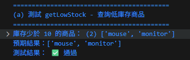
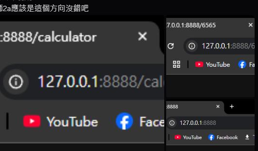
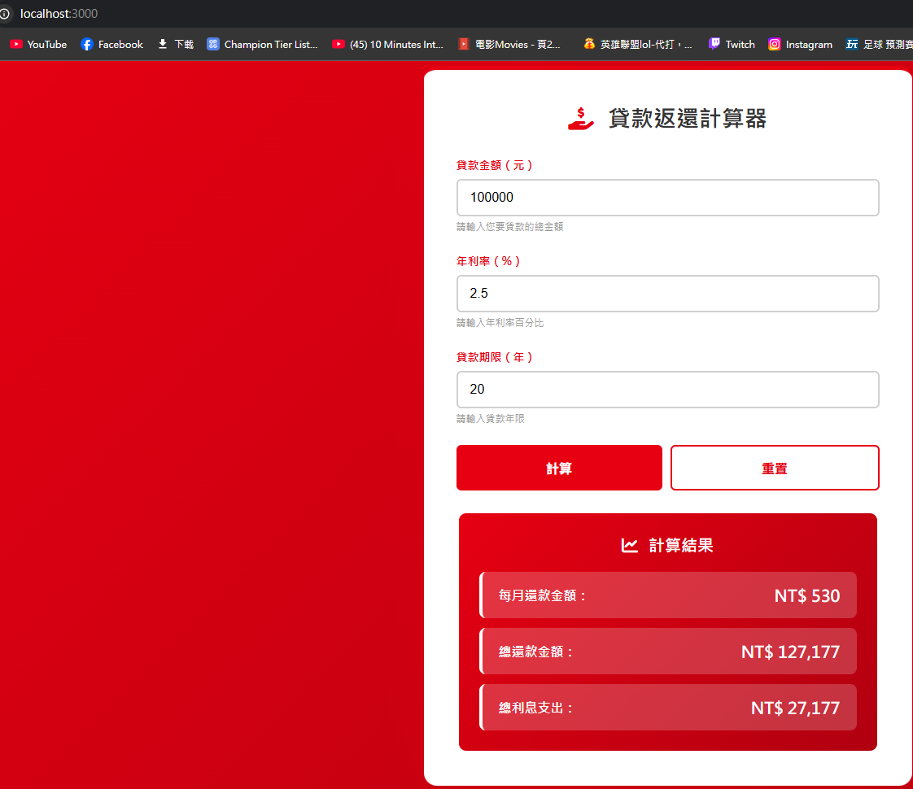
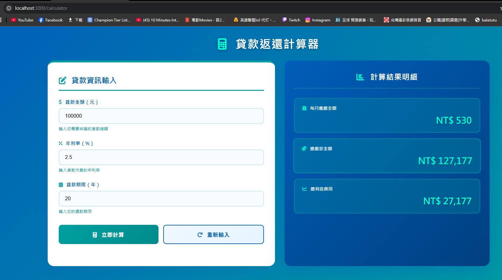
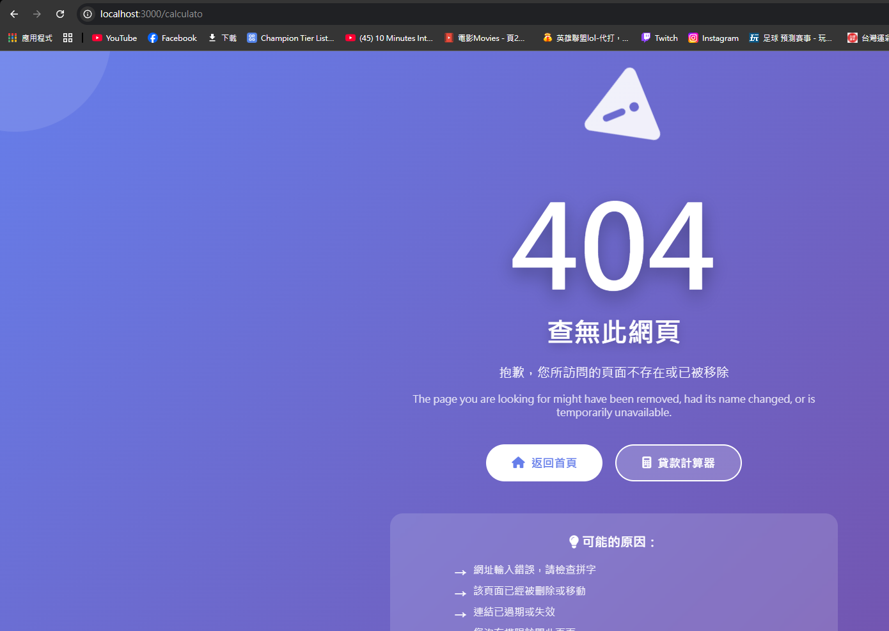

# 第2次隨堂題目-隨堂-QZ2
>
>學號：111111156   (學號和姓名都要寫)
><br />
>姓名：林家揚
>

本份文件包含以下主題：(至少需下面兩項，若是有多者可以自行新增)
- [x] 說明內容

## 說明程式與內容

開始寫說明，該說明需說明想法，
並於之後再對上述想法的每一部分將程式進一步進行展現，
若需引用程式區則使用下面方法，
若為.cs檔內程式除了於敘述中需註明檔案名稱外，
還需使用語法` ```語言種類 程式碼 ``` `，其中語言種類若是要用python則使用py，java則使用java，C/C++則使用cpp，
下段程式碼為語言種類選擇csharp使用後結果：

```js
public void mt_getResult(){
    ...
}
```

若要於內文中標示部分網頁檔，則使用以下標籤` ```html 程式碼 ``` `，
下段程式碼則為使用後結果：


1. a.

Ans:

1. b.

Ans:
```js
function getLowStock(products) {
    // 創造函式getLowStock，參數為products
    let lowStockItems = [];
    // 創造空陣列lowStockItems，專門存放庫存少於10的商品名稱
    for (let i = 0; i < products.length; i++) {
        // 用for迴圈跑products陣列，每次迴圈i加1
        if (products[i].stock < 10) {
            lowStockItems.push(products[i].name);
        };
        // 如果products陣列中第i個物件的stock屬性小於10，則把該物件的name屬性加入lowStockItems陣列
    };
    console.log("庫存少於 10 的項目：" ,lowStockItems);
    return lowStockItems;
};
```



1. c.

Ans:

<!--  我是分隔符號  -->

2. a.
 Ans:
 ```js
 switch(url){
    case '/':
      answer = 'index1.html';
      break
    case '/calculator':
      answer = 'index2.html';
      break;
    default:
      answer = 'error.html';  
  }   
  ``` 
  

2. b.
Ans:
```js
 switch (req.url) {
    case '/':
      // 首頁路由     
      filePath = '/index.ejs';
      break;    
    case '/calculator':   
      // 計算器頁面路由   
      filePath = '/index2.ejs'; 
      break;
    case '/style.css':
      // 靜態 CSS 檔案路由  
      fileOtherFile = '/style.css';
      break;    
    case '/script.js':  
      // 靜態 JS 檔案路由  
      fileOtherFile = '/script.js';
      break; 
     case '/style2.css':
      // 靜態 CSS 檔案路由  
      fileOtherFile = '/style2.css';
      break;
 } 
  ```
  
  

2. c.

Ans:
```js
case '/style3.css':
      // 靜態 CSS 檔案路由  
      fileOtherFile = '/style3.css';
      break    
    default:  
      // 其他路由 → 404 頁面  
      filePath = '/index3.ejs'; 
      break;
  } 
  ```


2. d.

Ans:

